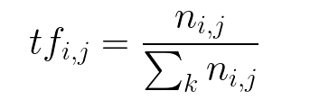

# 🚨🚨 Fake-News-Detector 🚨🚨 <!-- omit in toc -->

Classifying Fake news using TfidfVectorizer ⚙

# Table of Contents 📃

- [Table of Contents 📃](#table-of-contents-)
- [Synopsys 📝](#synopsys-)
- [So, What is Fake News🚫?](#so-what-is-fake-news)
- [What is a TfidfVectorizer💭?](#what-is-a-tfidfvectorizer)
- [Dataset🔘](#dataset)

# Synopsys 📝

The authenticity of Information has become a longstanding issue affecting businesses and society, both for printed and digital media. On social networks, the reach and effects of information spread occur at such a fast pace and so amplified that distorted, inaccurate or false information acquires a tremendous potential to cause real world impacts, within minutes, for millions of users.

Many foreign powers tries interfere with elections of a country using disinformation campaigns like FBI Chief admitted in [this article](https://www.bbc.com/news/technology-51399568). Platforms like Twitter and Facebook help facilitate the spreading of these misinformation and often conspiracy theories as well like Alex Jone's InfoWars. 
This [Wikipedia article](https://en.wikipedia.org/wiki/List_of_fake_news_websites) lists all the known popular Fake News websites citing their contribution in spreading misinformation and conspiracy theories.
[This Research Article](https://advances.sciencemag.org/content/6/14/eaay3539) discusses the scale of misinformation ecosystem.

Back in 2018, Elon Musk tweeted about an idea of creating a news credibility scoring website called **"Pravda"** which made me think about creating a Fake News Classifier like Spam-Ham classifier which we use daily in our emails.

<blockquote class="twitter-tweet">
Going to create a site where the public can rate the core truth of any article &amp; track the credibility score over time of each journalist, editor &amp; publication. Thinking of calling it Pravda …
&mdash; Elon Musk (@elonmusk) <a href="https://twitter.com/elonmusk/status/999367582271422464?ref_src=twsrc%5Etfw">May 23, 2018</a></blockquote>

In 2019, a group of reserchers made it possbile before Elon Musk and started a KickStarter campaign for it; [this article](https://www.sciencealert.com/scientists-have-beaten-elon-musk-to-a-fake-news-solution-and-it-s-gaining-traction) shares about their approach in greater details.

# So, What is Fake News🚫?

A simple [Wikipedia search](https://en.wikipedia.org/wiki/Fake_news) tells us, 

Fake news, is a form of news consisting of deliberate disinformation or hoaxes spread via traditional news media (print and broadcast) or online social media. Digital news has brought back and increased the usage of fake news, or yellow journalism. The news is then often reverberated as misinformation in social media but occasionally finds its way to the mainstream media as well.

# What is a TfidfVectorizer💭?

 TFIDF, short for *term frequency–inverse document frequency*, is a numerical statistic that is intended to reflect how important a word is to a document in a collection or corpus.

*Term Frequency*, the number of times a word appears in a document divded by the total number of words in the document.

*Inverse Data Frequency*, The log of the number of documents divided by the number of documents that contain the word w. Inverse data frequency determines the weight of rare words across all documents in the corpus.

Product of these two gives us the TF-IDF. The TfidfVectorizer converts a collection of raw documents into a matrix of TF-IDF features.

You can import TfidfVectorizer using `sklearn.feature_extraction.text.TfidfVectorizer`. Learn more about it [here](https://scikit-learn.org/stable/modules/generated/sklearn.feature_extraction.text.TfidfVectorizer.html).

# Dataset🔘

The dataset [`news.csv`](data/news.csv) has a shape of 7796×4. The first column identifies the news, the second and third are the title and text, and the fourth column has labels denoting whether the news is REAL or FAKE.